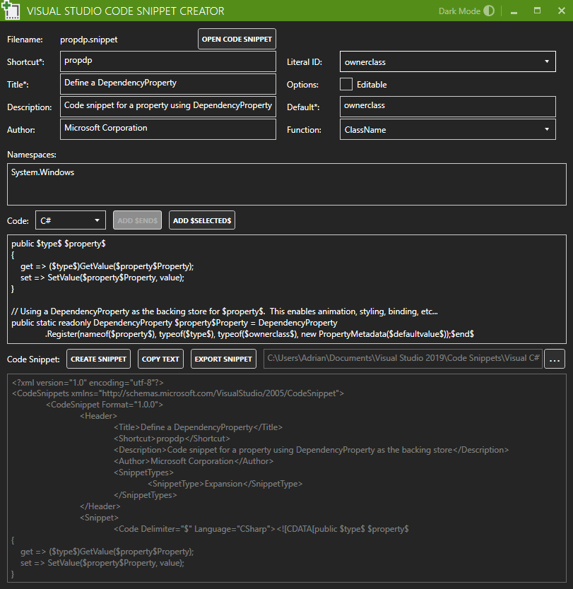

# VSCodeSnippetCreator

Create and edit code snippets for Visual Studio IDE in C#, XAML and more.

# Export Snippets
- Choose an export folder in the application
- Add the folder in Visual Studio: Tools -> Code Snippets Manager... -> Language
- Create/Edit your snippet and press 'Export Snippet' (run as administrator if necessary) 
- Type the snippet shortcut and press TAB twice

# Known limitations
I only use C# and XAML code snippets but I think the other languages should also work.

Not Supported:
- Multiple snippets per file
- Code element: Kind Attribute
- C# Function "GenerateSwitchCases"
- Following elements: "References", "HelpUrl" and "Object"

# Code snippet documentation 
https://docs.microsoft.com/en-us/visualstudio/ide/walkthrough-creating-a-code-snippet?view=vs-2019
https://docs.microsoft.com/en-us/visualstudio/ide/code-snippets-schema-reference?view=vs-2019
